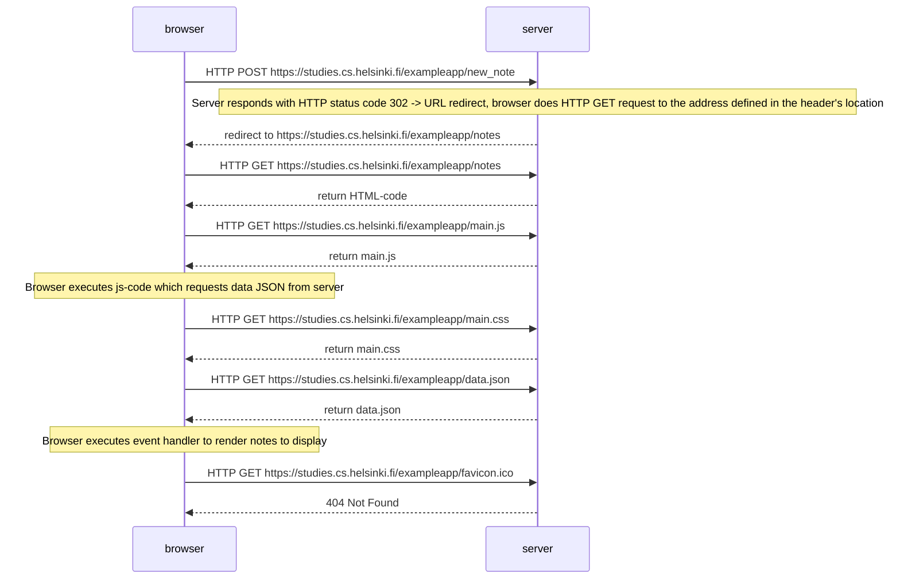

```mermaid
sequenceDiagram;
    participant browser
    participant server

    browser->>server: HTTP POST https://studies.cs.helsinki.fi/exampleapp/new_note
    Note over server: Server responds with HTTP status code 302 -> URL redirect, browser does HTTP GET request to the address defined in the header's location 
    server-->>browser: redirect to https://studies.cs.helsinki.fi/exampleapp/notes
    browser->>server: HTTP GET https://studies.cs.helsinki.fi/exampleapp/notes
    server-->>browser: return HTML-code
    browser->>server: HTTP GET https://studies.cs.helsinki.fi/exampleapp/main.js
    server-->>browser: return main.js
    Note over browser: Browser executes js-code which requests data JSON from server
    browser->>server: HTTP GET https://studies.cs.helsinki.fi/exampleapp/main.css
    server-->>browser: return main.css
    browser->>server: HTTP GET https://studies.cs.helsinki.fi/exampleapp/data.json
    server-->>browser: return data.json
    Note over browser: Browser executes event handler to render notes to display
    browser->>server: HTTP GET https://studies.cs.helsinki.fi/exampleapp/favicon.ico
    server-->>browser: 404 Not Found 
```