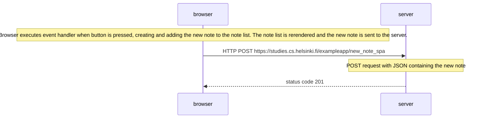

```mermaid
sequenceDiagram;
    participant browser
    participant server

    Note over browser: Browser executes event handler when button is pressed, creating and adding the new note to the note list. The note list is rerendered and the new note is sent to the server.
    browser->>server: HTTP POST https://studies.cs.helsinki.fi/exampleapp/new_note_spa 
    Note over server: POST request with JSON containing the new note
    server-->>browser: status code 201
```